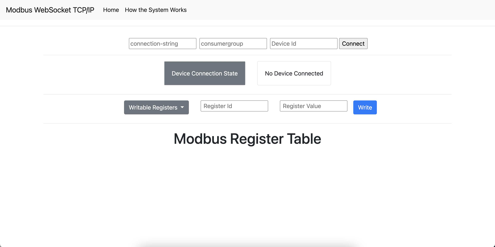
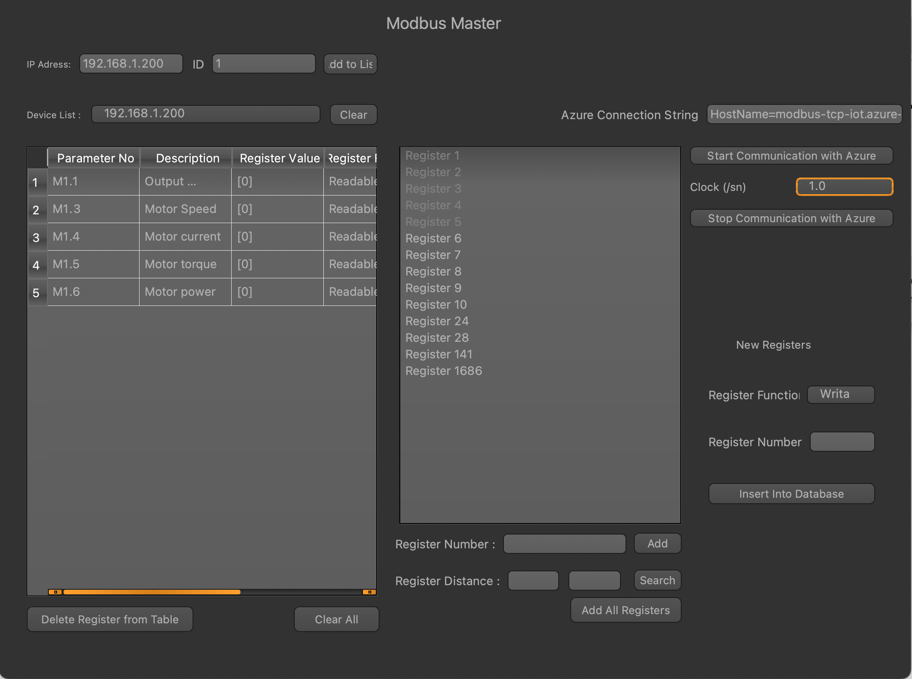

# Modbus Web App

This is an app for managing devices with modbus tcp/ip communication


## Web Application



This web application pulls data from azure iot hub and displays the data in tables, it also allows us to access the device and change the register values thanks to the connection provided by azure. 

This web app simply built on the following codes

**Reading messages coming on azure iot hub**
```node
const EventHubReader = require('./scripts/event-hub-reader.js');
const WebSocket = require('ws');

let iotHubConnectionString = "CONNECTION_STRING"
let consumergroup = "CONSUMER_GROUP"

const wss = new WebSocket.Server({ server }); // This web socket server provide us communicate with client browser side

const eventHubReader = new EventHubReader(iotHubConnectionString, consumergroup)

  (async () => {
    await eventHubReader.startReadMessage((message, date, deviceId) => {
      try {
        const payload = {
          IotData: message,
          MessageDate: date || Date.now().toISOString(),
          DeviceId: deviceId,
        };
  
        console.log(payload)
        wss.broadcast(JSON.stringify(payload));
      } catch (err) {
        console.error('Error broadcasting: [%s] from [%s].', err, message);
      }
    });
  })().catch();

```
**Sending messages to azure iot hub**

```node
wss.on('connection', ws => {
  ws.on('message', message => {
    // console.log("Client Message : " + message)

    if (JSON.parse(message).method == 'writeRegister') {
      console.log("WRITE REGISTER METHOD WORKING")

      console.log("Coming data is" + JSON.parse(message).sendRegisterId, JSON.parse(message).sendRegisterValue)

      sendRegisterId =  String(JSON.parse(message).sendRegisterId)
      sendRegisterValue = String(JSON.parse(message).sendRegisterValue)

      var Client = require('azure-iothub').Client;
      var Message = require('azure-iot-common').Message;

      var connectionString = "HostName=modbus-tcp-iot.azure-devices.net;SharedAccessKeyName=service;SharedAccessKey=5ZCPyIUC7prmgWfQueBajDqSGtMUe6YZvwiiwYovB3A=";
      var targetDevice = 'mypi';

      var serviceClient = Client.fromConnectionString(connectionString);

      serviceClient.open(function (err) {
        if (err) {
          console.error('Could not connect: ' + err.message);
        } else {
          console.log('Service client connected');
          var message = new Message(sendRegisterId+"," +sendRegisterValue);
          console.log('Sending message: ' + message.getData());
          serviceClient.send(targetDevice, message);
          console.log("Buraya geldi")
        }
      });


    }

  })
})
```

## Device Manager

Device manager works in raspberry pi for managing devices which connected to shared network



This app directly connected to azure iot hub, thanks to this method we can get that register values and register addresses almost every second (it depends which clock you choosed). 

This program is a structure built on the following codes

**Sending messages to azure iot hub**
```python
def sendDatatoAzure(registerNumber, distance):

    clientAzure = IoTHubDeviceClient.create_from_connection_string(CONNECTION_STRING)

    client = ModbusClient(host="192.168.1.200", port = 502)

    client.open()

    data = client.read_holding_registers(registerNumber, distance)

    message = Message(data)

    clientAzure.send_message(str(message))
```
**Reading messages comes from azure iot hub**
```python
 def message_handler(message):

    a = str(message)

    list = a.split(",")

    newlist = []

    for i in list:

        newlist.append(int(re.search(r'\d+', i).group()))
    
    print(newlist)

    client = ModbusClient(host="192.168.1.200", port = 502)

    client.open()

    client.write_multiple_registers(newlist[0], [newlist[1]])
  
def getDatafromAzure():
    print ("Starting the Python IoT Hub C2D Messaging device sample...")

    # Instantiate the client
    clientAzure = IoTHubDeviceClient.create_from_connection_string(CONNECTION_STRING)

    print ("Waiting for C2D messages, press Ctrl-C to exit")
    try:
        # Attach the handler to the client
        clientAzure.on_message_received = message_handler

        while True:
            time.sleep(1000)
    except KeyboardInterrupt:
        print("IoT Hub C2D Messaging device sample stopped")
    finally:
        # Graceful exit
        print("Shutting down IoT Hub Client")
        clientAzure.shutdown()
 ```

### What purpose does device manager serve?
Device manager provide us to send the memory we want and its values ​​to the azure iot hub, we can do both read and write operations with this program. 

